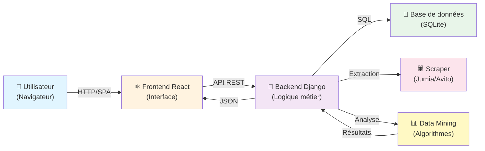
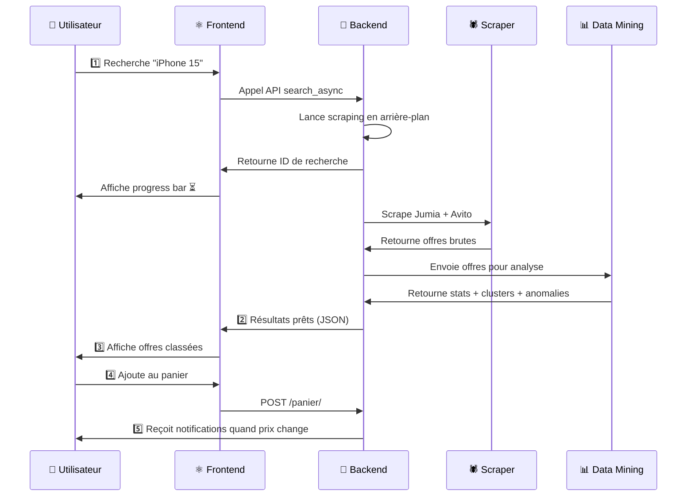
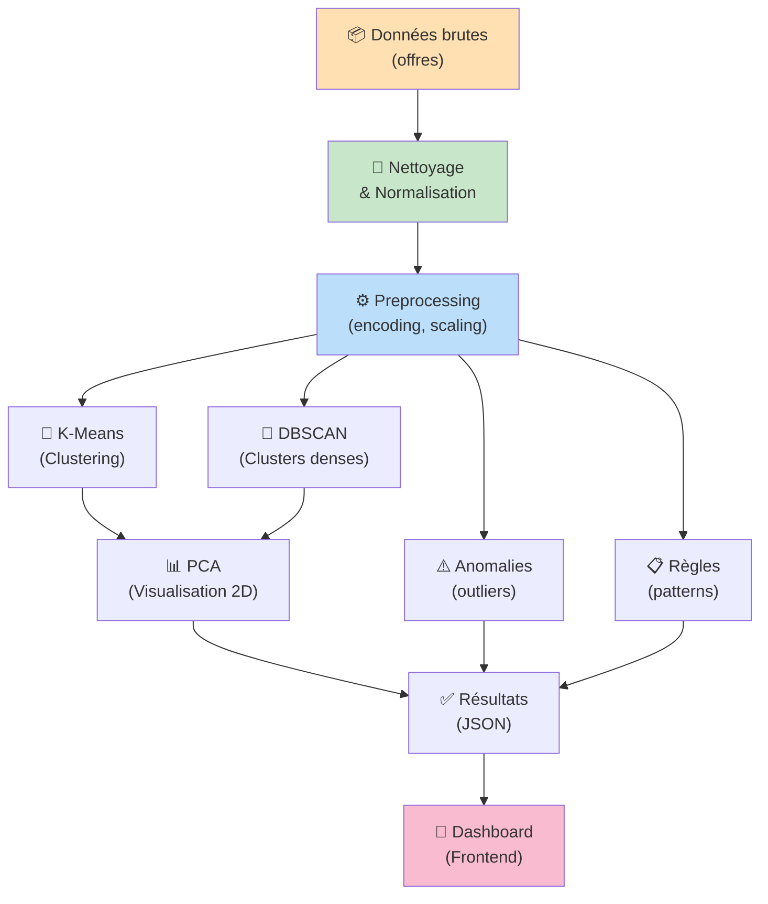
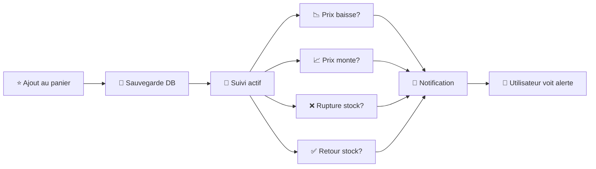
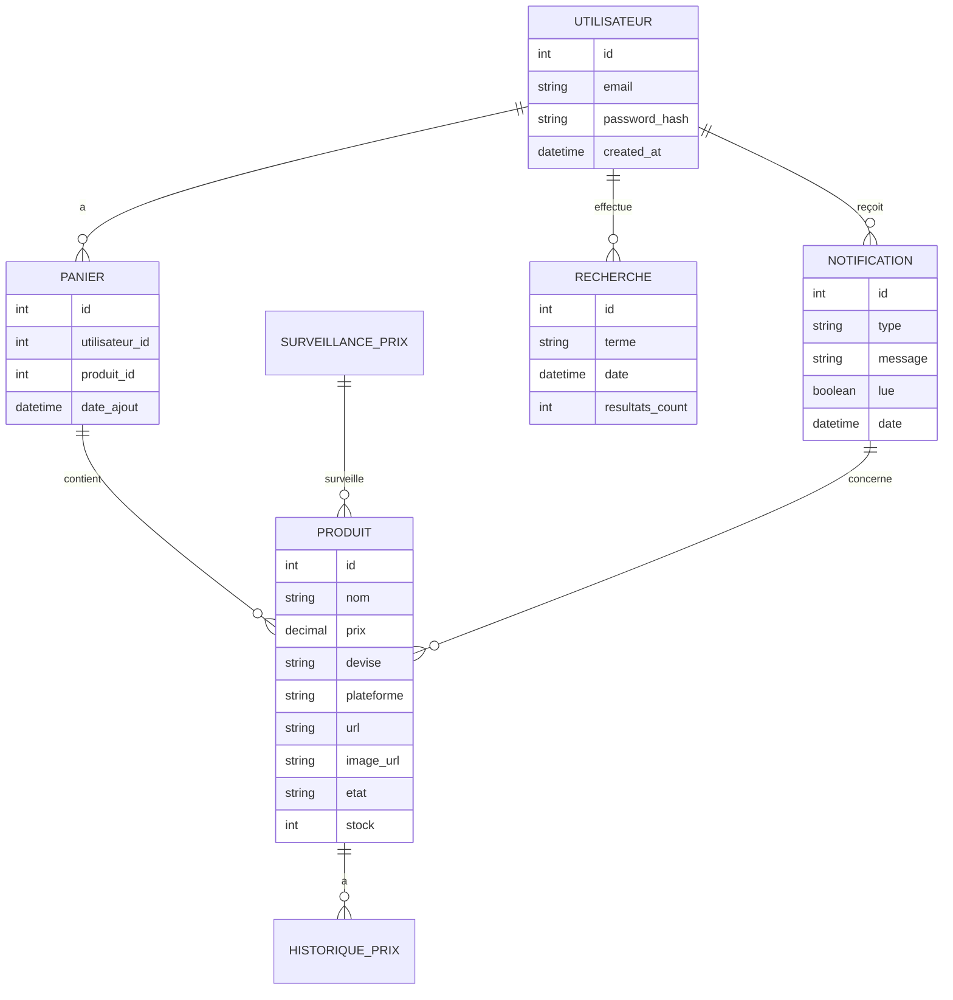

# 🛍️ Smart Price Analytics Platform

> **Un comparateur de prix intelligent pour l'e-commerce marocain**

---

## 🎬 Démonstration vidéo

Voici une démonstration complète du projet en action :

### Vidéo de démonstration

<video width="100%" height="auto" controls style="border-radius: 8px; box-shadow: 0 4px 6px rgba(0,0,0,0.1);">
  <source src="https://github.com/imane-mbarek/smart-price-analytics-platform/raw/main/demo-video.mp4" type="video/mp4">
  Votre navigateur ne supporte pas la lecture vidéo.
</video>

> 📹 **Fichier vidéo local :** `../Enregistrement site web .mp4`

### Ce que vous verrez dans la vidéo :

✅ **Recherche d'un produit** - Interface de recherche intuitive  
✅ **Affichage des offres** - Cartes produits avec prix et détails  
✅ **Analyse Data Mining** - Clustering, détection d'anomalies  
✅ **Gestion du panier** - Ajout et suivi des produits  
✅ **Notifications en temps réel** - Alertes de prix  
✅ **Export des résultats** - CSV et PDF  

---

## 📋 Qu'est-ce que c'est ?

Smart Price Analytics Platform est une **application web complète** qui permet de :
- 🔍 **Comparer les prix** automatiquement sur les marketplaces marocaines (Jumia, Avito)
- 💡 **Analyser intelligemment** les offres avec des algorithmes de data mining
- 📱 **Surveiller les produits** dans un panier personnel
- 🔔 **Recevoir des alertes** quand les prix baissent ou montent
- 📊 **Visualiser les données** dans une interface moderne et simple
- 🚨 **Détecter les anomalies** et éviter les arnaquettes

---

## 🏗️ Architecture globale



### 3 Composantes principales :

| Composant | Technologie | Rôle |
|-----------|-------------|------|
| **Frontend** | React + Axios | Interface utilisateur, recherche, panier |
| **Backend** | Django + DRF | API REST, scraping, gestion données |
| **Data Mining** | Python (scikit-learn, pandas) | Analyse statistique, clustering, anomalies |

---

## 🎯 Flux utilisateur



---

## 🚀 Démarrer le projet

### Prérequis
- **Python 3.8+**
- **Node.js 14+**
- **pip** et **npm**

### 1️⃣ Installation du Backend

```bash
# Aller dans le dossier backend
cd backend

# Installer les dépendances
pip install -r requirements.txt

# Appliquer les migrations
python manage.py migrate

# Lancer le serveur
python manage.py runserver
```
→ L'API sera disponible sur `http://localhost:8000`

### 2️⃣ Installation du Frontend

```bash
# Aller dans le dossier frontend
cd frontend

# Installer les dépendances
npm install

# Lancer le serveur de développement
npm start
```
→ L'interface sera disponible sur `http://localhost:3000`

### 3️⃣ Data Mining (optionnel pour les analyses)

```bash
# Installer les dépendances
cd data_mining
pip install -r requirements.txt
```

---

## 📊 Fonctionnalités principales

### 🔍 Recherche et Scraping
```
Utilisateur entre "iPhone 15"
    ↓
Backend lance le scraping de Jumia et Avito
    ↓
Collecte les offres, normalise les prix en MAD
    ↓
Sauvegarde dans la base de données
    ↓
Affiche progression en temps réel
```

### 📈 Analyse Data Mining

Le système applique des **algorithmes intelligents** :



**Algorithmes utilisés :**
- 🎯 **K-Means** : Segmentation des offres par gamme de prix
- 🔴 **DBSCAN** : Détection de clusters denses et points isolés
- 📈 **PCA** : Réduction de dimensions pour visualisation
- ⚠️ **Détection d'anomalies** : Identification des prix suspects
- 📋 **Règles d'association** : Patterns entre caractéristiques

### 📱 Panier et Notifications



---

## 📁 Structure du projet

```
smart-price-analytics-platform/
├── 📂 backend/                  # Django + API REST
│   ├── manage.py
│   ├── Project_analysis/        # App principale
│   │   ├── models.py            # Modèles (Produit, Panier, etc.)
│   │   ├── views.py             # API endpoints
│   │   └── serializers.py       # Sérialisation JSON
│   ├── api/                     # Routes supplémentaires
│   └── requirements.txt
│
├── 📂 frontend/                 # React + Axios
│   ├── public/
│   ├── src/
│   │   ├── components/          # Composants réutilisables
│   │   ├── pages/               # Pages (Accueil, Panier, etc.)
│   │   ├── hooks/               # Custom hooks (useSearch, useAuth)
│   │   └── App.js               # Point d'entrée
│   ├── package.json
│   └── build/                   # Build optimisé
│
├── 📂 data_mining/              # Analyse statistique
│   ├── api/
│   │   └── dm_service.py        # Service principal
│   ├── preprocessing/           # Nettoyage des données
│   ├── clustering/              # K-Means, DBSCAN
│   ├── anomaly/                 # Détection d'anomalies
│   ├── association/             # Extraction de règles
│   ├── stats/                   # Statistiques descriptives
│   ├── tests/                   # Tests unitaires
│   └── requirements.txt
│
├── 📄 README.md                 # Ce fichier
├── 📊 presentation_soutenance.pptx
└── requirements.txt
```

---

## 🔧 Modèles de données

Les données principales stockées en base :



---

## 🎨 Pages de l'Interface

### 🏠 Accueil
- Barre de recherche
- Sélection des plateformes (Jumia, Avito)
- Affichage des offres trouvées
- Export CSV / PDF
- Indicators de qualité (détectées par Data Mining)

### 📦 Panier
- Liste des produits surveillés
- Historique des prix
- Suppression d'articles
- **Accès après authentification**

### 🔔 Notifications
- Alertes de baisse/hausse de prix
- Alertes de stock
- Marquer comme lu
- **Accès après authentification**

### 📜 Historique
- Historique des recherches
- Statistiques (nb d'offres, prix moyens)
- Recherches sauvegardées

### 🔐 Authentification
- Inscription utilisateur
- Connexion
- Gestion du profil

---

## 📚 API REST - Endpoints principaux

| Endpoint | Méthode | Description |
|----------|---------|-------------|
| `/produits/accueil/` | GET | Liste des produits |
| `/produits/search_async/` | POST | Lance une recherche asynchrone |
| `/produits/progression/` | GET | Suivi du scraping (%) |
| `/produits/analyser/` | POST | Déclenche analyse Data Mining |
| `/produits/export_csv/` | GET | Export en CSV |
| `/produits/export_pdf/` | GET | Export en PDF |
| `/panier/` | GET/POST | Gestion du panier |
| `/notifications/` | GET | Liste des notifications |
| `/search_history/` | GET | Historique des recherches |

---

## 🧪 Tests et Qualité

### Lancer les tests du Data Mining
```bash
cd data_mining
pytest tests/
```

### Lancer le linter
```bash
cd backend
pylint Project_analysis/
```

---

## 💾 Base de données

Le projet utilise **SQLite** (adaptation facile à PostgreSQL en production) :

```bash
# Accéder à la DB depuis le backend
python manage.py dbshell

# Créer les tables
python manage.py migrate
```

---

## 🎓 Cas d'usage complet

### Scénario : Rechercher un iPhone 15

```
1. L'utilisateur se connecte/s'inscrit ✅
2. Il entre "iPhone 15" et sélectionne Jumia + Avito
3. Le backend lance le scraping (barre de progression)
4. Données collectées → Nettoyage des prix → Conversion en MAD
5. Data Mining analyse les offres :
   - Détecte 3 clusters de prix (gamme basse, normale, premium)
   - Signale 1 anomalie (prix anormalement bas = possible arnaque)
   - Extrait des règles (ex: prix bas = stock faible)
6. Frontend affiche :
   - ✅ Offres classées par cluster
   - ⚠️ Anomalies signalées en rouge
   - 📊 Statistiques (min, max, moyenne, écart-type)
7. Utilisateur ajoute une offre au panier
8. Si le prix baisse de 10% → Notification immédiate 🔔
9. Il exporte les résultats en CSV/PDF 📥
```

---

## 🚀 Prochaines étapes / Améliorations futures

- ✨ Ajouter d'autres plateformes (Amazon, Alibaba, etc.)
- 🗄️ Migrer vers PostgreSQL pour la production
- 🤖 Ajouter un modèle ML de détection de fraude
- 📈 Dashboards graphiques plus riches
- 🌍 Support multi-langues
- 📲 Application mobile

---

## 👨‍💻 Technologies utilisées

| Domaine | Technologie |
|---------|------------|
| **Frontend** | React, Axios, React Router, CSS3 |
| **Backend** | Django, Django REST Framework |
| **Database** | SQLite (expandable à PostgreSQL) |
| **Data Mining** | scikit-learn, pandas, numpy |
| **Scraping** | BeautifulSoup, Requests (Python) |
| **Autres** | ReportLab (PDF), threading |

---

## 📞 Support et Contact

Pour toute question sur le projet, consultez :
- 📖 `presentation_soutenance.md` - Documentation académique complète
- 📊 `presentation_soutenance.pptx` - Diaporama détaillé

---

## 📝 License

Ce projet est fourni à titre académique et opérationnel.

---

**Bienvenue sur Smart Price Analytics Platform! 🎉**