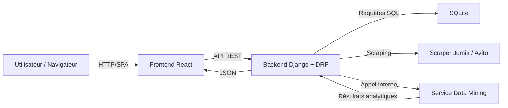
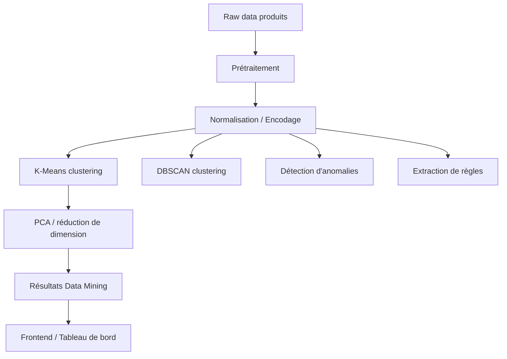

# Présentation académique du projet

## 1. Introduction

**Titre du projet**: Smart Price Analytics Platform

**Objectif principal**:
- Proposer un outil web capable de comparer automatiquement les prix de produits sur plusieurs marketplaces marocaines.
- Offrir une analyse intelligente des prix, une veille de panier et des notifications de variation.
- Permettre un usage fluide via une interface web moderne, et enrichir le service avec des modules de data mining.

**Contexte**:
- Analyse du e-commerce marocain pour aider l’utilisateur à éviter les arnaques et trouver le meilleur prix.
- Application combinant scraping, backend Django, data mining et frontend React.

---

## 2. Architecture globale

### 2.1 Architecture technique

Figure 1 illustre l’architecture globale du système.

### 2.2 Séparation des couches

- **Frontend**: interface utilisateur réactive, recherche, visualisation, panier et notifications.
- **Backend**: API REST, modèles métiers, scraping, nettoyage des prix, journalisation et notifications.
- **Data Mining**: extraction de règles, détection d’anomalies, clustering et réduction de dimension.

---

## 3. Backend

### 3.1 Technologies utilisées

- Django
- Django REST Framework
- SQLite
- threading Python pour le scraping en arrière-plan
- ReportLab pour l’export PDF

### 3.2 Modèles de données principaux

- `Produit` : représente chaque offre collectée, avec son nom, description, prix, catégorie, plateforme, URL, image et stock.
- `HistoriquePrix` : archive l’évolution du prix d’un produit dans le temps.
- `Panier` : stocke les produits suivis par un utilisateur.
- `Notification` : gère les alertes de variation de prix et de disponibilité.
- `Recherche` : trace les recherches réalisées par les utilisateurs.
- `SurveillancePrix` : permet de définir un prix cible et de déclencher une alerte.

### 3.3 Fonctions backend clés

#### Scraping et collecte
- Le backend lance le scraping de Jumia et Avito.
- Les prix sont normalisés en MAD via un convertisseur de devises.
- Les offres sont sauvegardées et mises à jour dans la base de données.

#### Nettoyage des données
- `clean_price()` transforme des chaînes de prix en valeurs numériques.
- Gère les devises `$`, `€`, `£`, et les fourchettes de prix.
- Convertit automatiquement toutes les valeurs en MAD.

#### Gestion du panier et des notifications
- Lorsqu’un produit dans un panier change de prix ou de disponibilité, le backend crée une notification.
- Notifications prises en charge:
  - baisse de prix significative
  - hausse de prix significative
  - rupture de stock
  - retour en stock

### 3.4 API disponibles

- `/produits/accueil/` : page d’accueil des produits disponibles.
- `/produits/search_async/` : lancement de la recherche asynchrone.
- `/produits/progression/` : suivi du scraping et de l’analyse.
- `/produits/analyser/` : déclenche l’analyse data mining sur les résultats.
- `/produits/export_csv/` et `/produits/export_pdf/` : export des résultats.

---

## 4. Module Data Mining

### 4.1 Objectif du module

- Enrichir les résultats de scraping par une analyse statistique et un apprentissage non supervisé.
- Fournir des indicateurs de qualité d’offre, d’anomalie, de cluster et de règles d’association.

### 4.2 Pipeline de traitement

Figure 2 décrit le flux data mining.

### 4.3 Algorithmes implémentés

- **Clustering K-Means** : segmentation des offres en gammes ou groupes similaires.
- **DBSCAN** : détection de clusters denses et de points isolés.
- **PCA** : réduction des dimensions pour visualiser les clusters.
- **Détection d’anomalies** : identification des offres suspectes ou hors tendance.
- **Règles d’association** : extraction de patterns entre caractéristiques de produits.
- **Statistiques descriptives** : moyenne, médiane, écart-type.

### 4.4 Rôle dans l’application

- Classement des offres par gamme de prix.
- Identification des prix anormaux.
- Aide à la décision pour l’utilisateur.
- Enrichissement des cartes produits avec des recommandations.

---

## 5. Frontend

### 5.1 Technologies utilisées

- React
- React Router
- Axios
- Context API / hooks personnalisés
- CSS simple et composants modulaires

### 5.2 Pages principales

- **Accueil**: recherche produit, sélection de plateformes, affichage des offres, export CSV/PDF.
- **Historique**: consultation des recherches passées.
- **Panier**: suivi des produits surveillés et suivi des variations de prix.
- **Notifications**: affichage des alertes de prix et de stock.
- **Login / Inscription**: gestion de l’authentification.

### 5.3 Hooks et logique métiers

- `useSearch` : contrôle la recherche asynchrone, interroge le backend, affiche la progression, récupère l’analyse DM.
- `useAuth` : gère l’état de l’utilisateur et les jetons d’accès.
- `usePanier` : suit les produits ajoutés, le nombre d’articles et les opérations de suppression.
- `useNotifications` : synchronise les alertes et l’état lu/non lu.

### 5.4 Fonctionnalités clés de l’interface

- Sélection multi-plateformes (Jumia, Avito).
- Filtrage automatique des accessoires non pertinents.
- Progress bar pendant le scraping.
- Présentation visuelle des produits et insights.
- Export de résultats pour exploitation externe.
- Notifications et panier accessibles seulement après authentification.

---

## 6. Cas d’usage et scénario utilisateur

### Exemple de parcours

1. L’utilisateur s’inscrit ou se connecte.
2. Il recherche un produit (ex. "iPhone 15").
3. Le système scrape Jumia et Avito en arrière-plan.
4. L’utilisateur voit la progression, puis la liste des offres.
5. L’analyse Data Mining classe les offres, signale les anomalies et propose une lecture rapide.
6. Il ajoute des offres au panier pour les surveiller.
7. Il reçoit des notifications si le prix change ou si l’offre revient en stock.

### Valeur ajoutée

- Réduction du temps de comparaison de prix.
- Aide à repérer les offres potentiellement frauduleuses.
- Suivi individuel des produits importants.
- Analyse intelligente des données au-delà du simple comparateur.

---

## 7. Avantages et contraintes

### Avantages

- Solution complète du scraping à la visualisation.
- Architecture modulaire claire.
- Bonne séparation backend / data mining / frontend.
- Extension possible à d’autres marketplaces.

### Contraintes

- Dépendance à la structure HTML des sites scrappés.
- Base SQLite adaptée pour un prototype, à faire évoluer en production.
- Exécution des algorithmes DM en temps réel sur le backend.

---

## 8. Conclusion

- Le projet propose un outil académique et opérationnel pour l’analyse de prix en ligne.
- Il combine des techniques de scraping, de traitement de données et de data mining.
- Sa structure permet une soutenance claire: introduction, architecture, backend, data mining, frontend, démonstration et conclusion.

### Pistes d’amélioration

- Ajouter d’autres plateformes (Maroc, international).
- Passer à une base de données plus robuste (PostgreSQL).
- Renforcer l’analyse avec un modèle de détection de fraude.
- Ajouter des dashboards graphiques plus riches.

---

## 9. Figures proposées

- **Figure 1**: architecture technique Web / API / base de données / data mining.
- **Figure 2**: pipeline data mining (prétraitement, clustering, anomalies, règles).
- **Figure 3**: workflow utilisateur (inscription, recherche, panier, notification).

*Ces figures peuvent être dessinées sous forme de schémas lors de la soutenance, ou intégrées dans un diaporama.*
